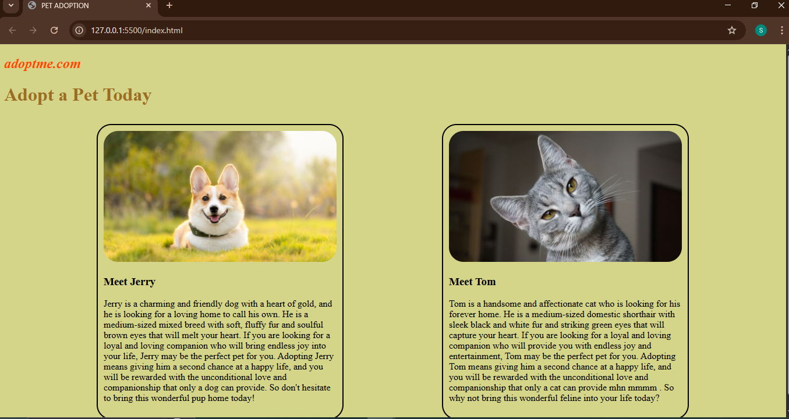

# Pet Adoption Website

This is a simple pet adoption website project created with HTML and CSS.  
It features profiles for pets available for adoption with descriptions and images.

## Features

- Responsive design using Flexbox
- Pet profile cards with images and details
- Simple, clean styling with CSS

## How to Use

1. Open `index.html` in your browser to view the website.
2. Customize the pet details or add more pets by editing the HTML.

## Screenshots

  

